---
## Author
author:
  name: Акунаева Антонина Эрдниевна
  degrees: Bachelor, 2nd course
  orcid: 0000-0002-0877-7063
  email: 1032240492@pfur.ru
  affiliation:
    - name: Российский университет дружбы народов
      country: Российская Федерация
      postal-code: 115419
      city: Москва
      address: ул. Орджоникидзе, д. 3
## Title
title: Структура научной презентации
subtitle: Простейший вариант
license: CC BY
date: today
date-format: "2025-09-06"
---

# Информация

## Докладчик

:::::::::::::: {.columns align=center}
::: {.column width="70%"}

  * Акунаева Антонина Эрдниевна
  * студент группы НПИбд-01-24
  * ФФМиЕН
  * Российский университет дружбы народов им. П. Лумумбы
  * [1032240492@pfur.ru](mailto:1032240492@pfur.ru)
  * <https://github.com/Akuxee>

:::
::: {.column width="30%"}


:::
::::::::::::::

# Цели и задачи

- Целью данной работы является приобретение практических навыков установки операционной системы на виртуальную машину, настройки минимально необходимых для дальнейшей работы сервисов.
- Выполнить домашнюю работу после выполнения лабораторной работы.

# Материалы и методы

- Linux (дистрибутив Rocky 9.6)
- Linux Fedora Workstation (Markdown)
- Oracle VirtualBox

# Выполнение лабораторной работы

## Создание ОС Rocky Linux

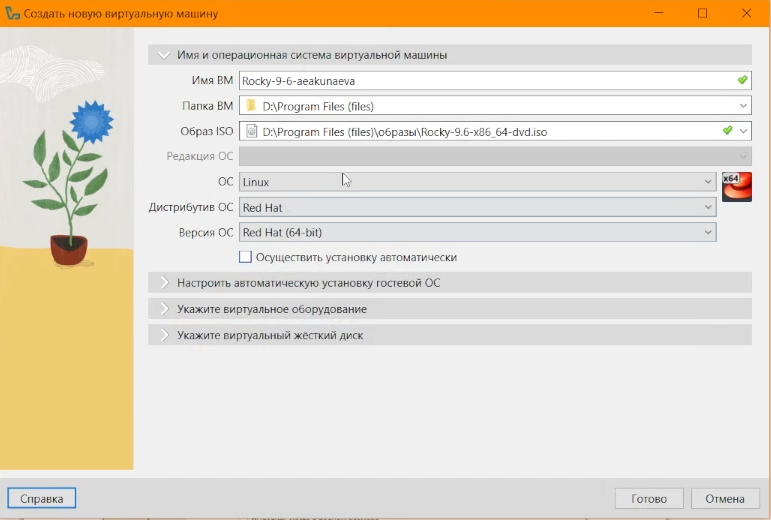{#fig-001 width=70%}

## Виртуальное оборудование Rocky Linux

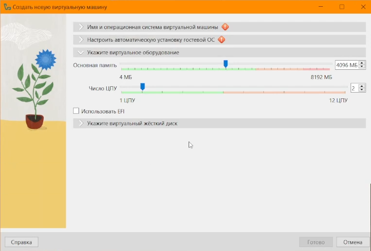{#fig-002 width=70%}

## Виртуальный жёсткий диск Rocky Linux

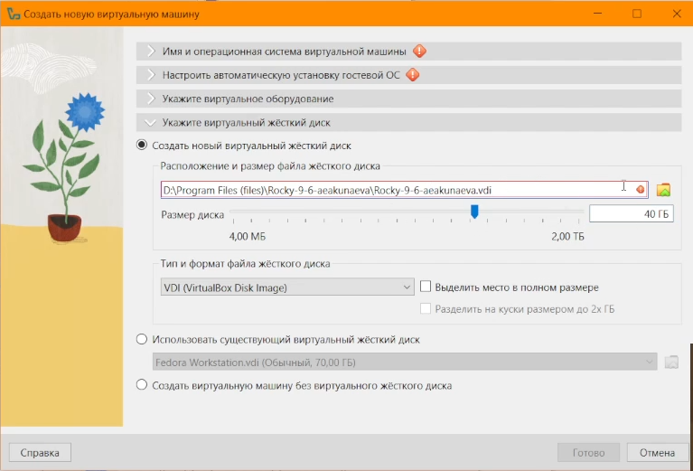{#fig-003 width=70%}

## Окно установки Rocky Linux

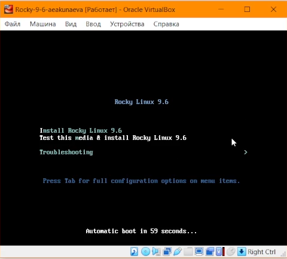{#fig-004 width=70%}

## Окно установки Rocky Linux

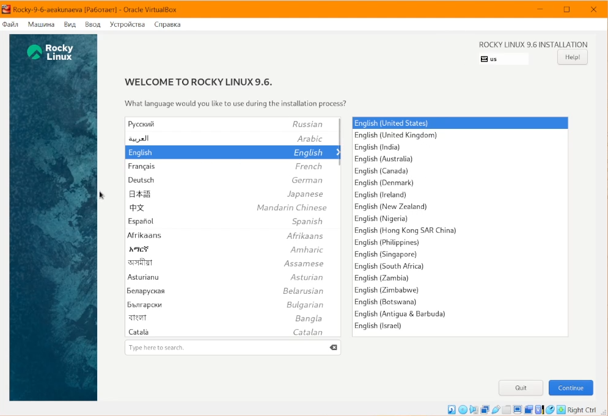{#fig-005 width=70%}

## Настройка Rocky Linux: оборудование

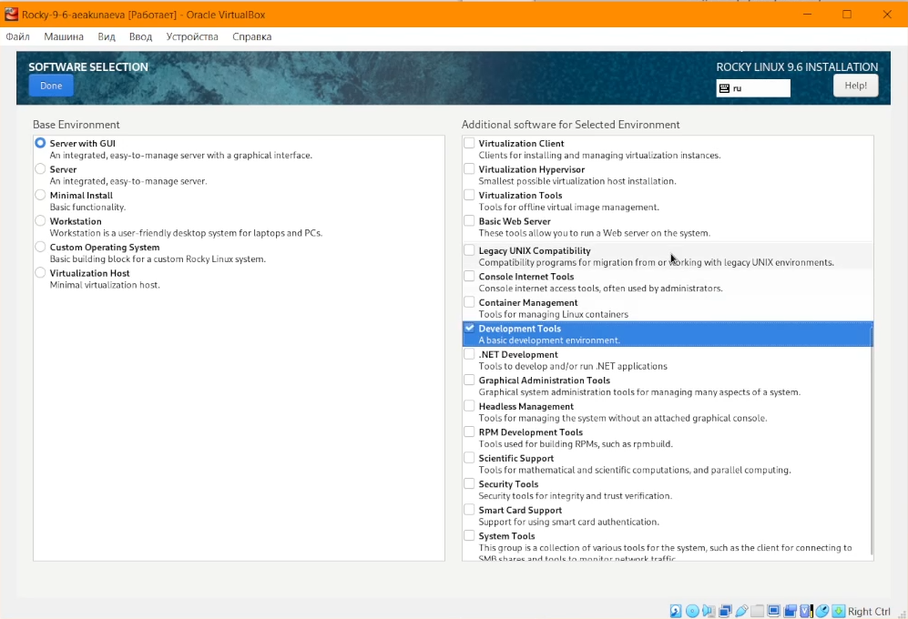{#fig-006 width=70%}

## Настройка Rocky Linux: раскладка клавиатуры

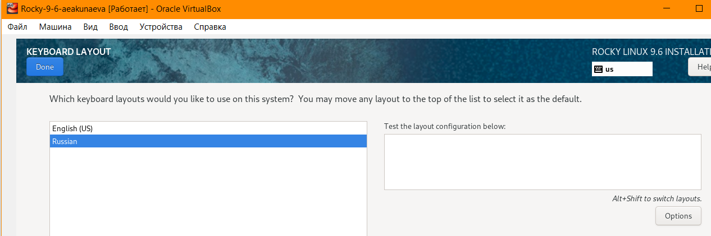{#fig-007 width=70%}

## Настройка Rocky Linux: поддержка языков

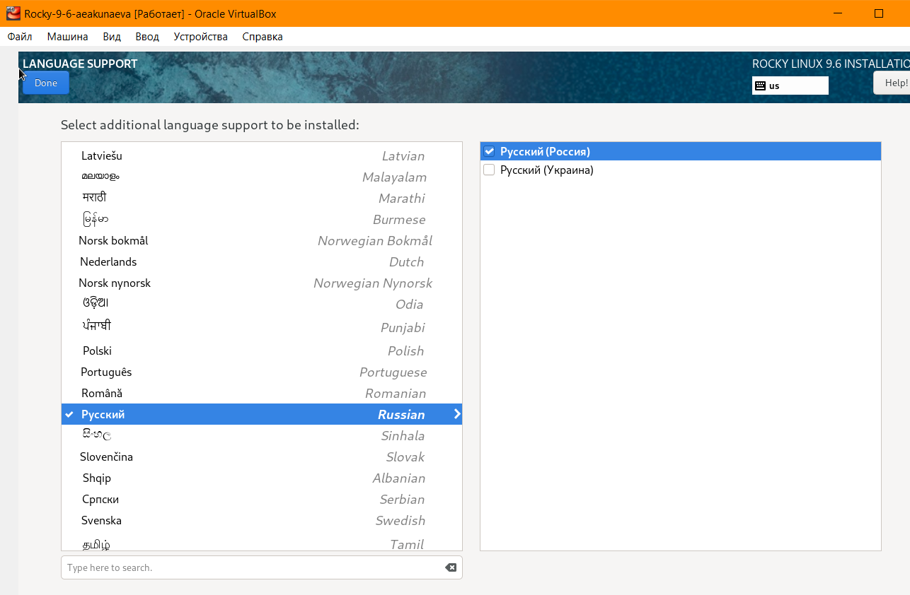{#fig-008 width=70%}

## Настройка Rocky Linux: KDUMP

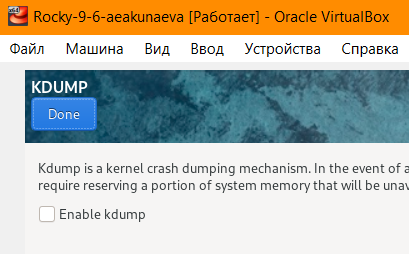{#fig-009 width=70%}

## Настройка Rocky Linux: настройка сети

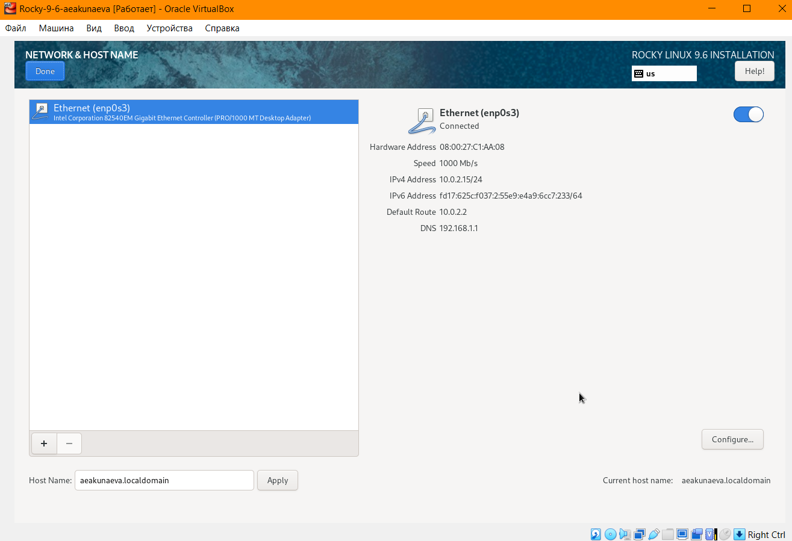{#fig-010 width=70%}

## Настройка Rocky Linux: добавление пароля root

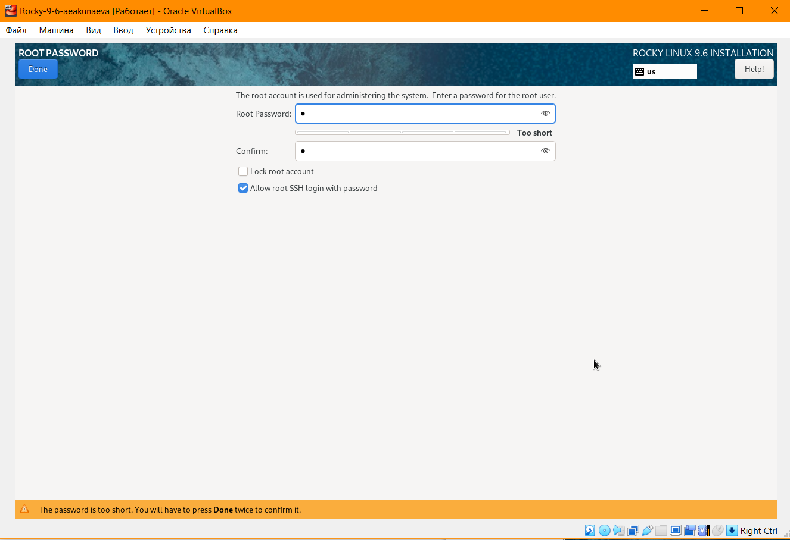{#fig-011 width=70%}

## Настройка Rocky Linux: добавление администратора

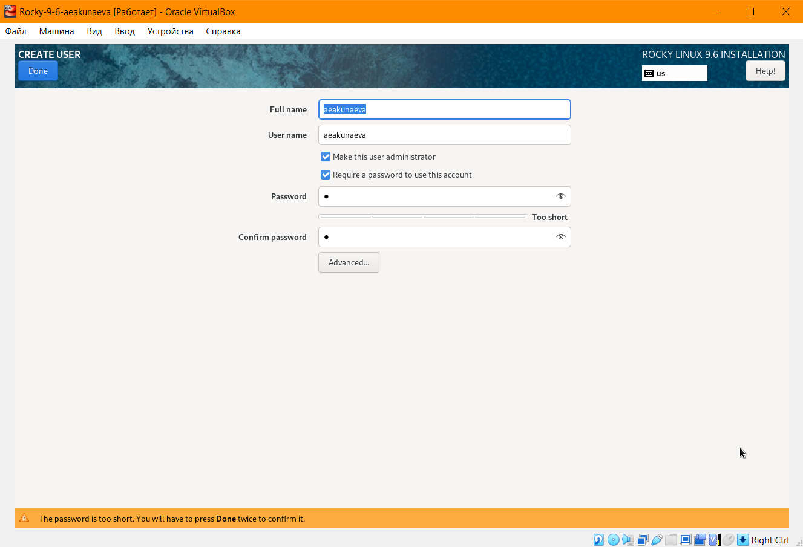{#fig-012 width=70%}

## Завершение настройки Rocky Linux

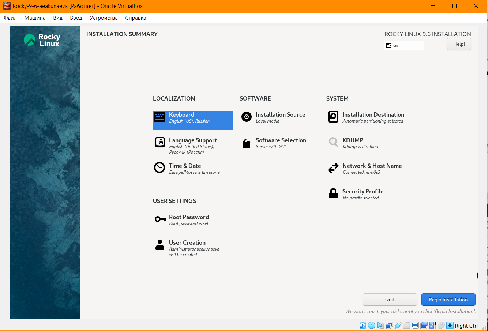{#fig-013 width=70%}

## Завершение установки Rocky Linux

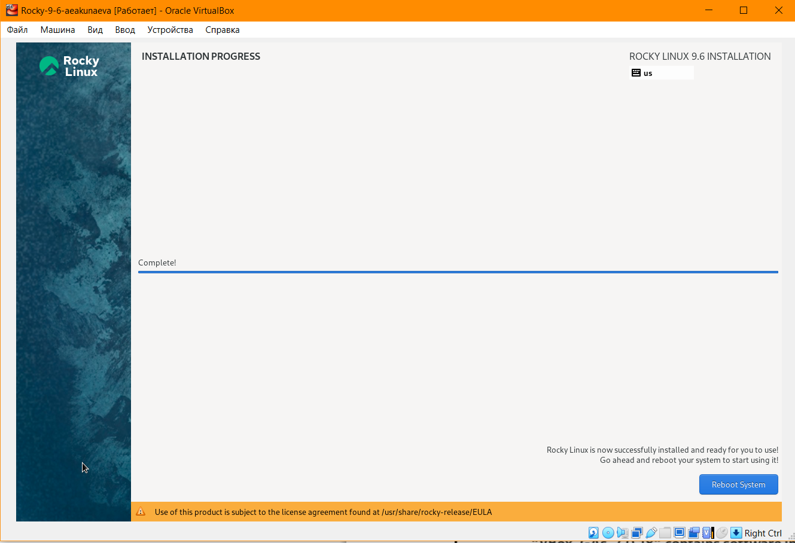{#fig-014 width=70%}

## Подключение образа диска дополнений гостевой ОС

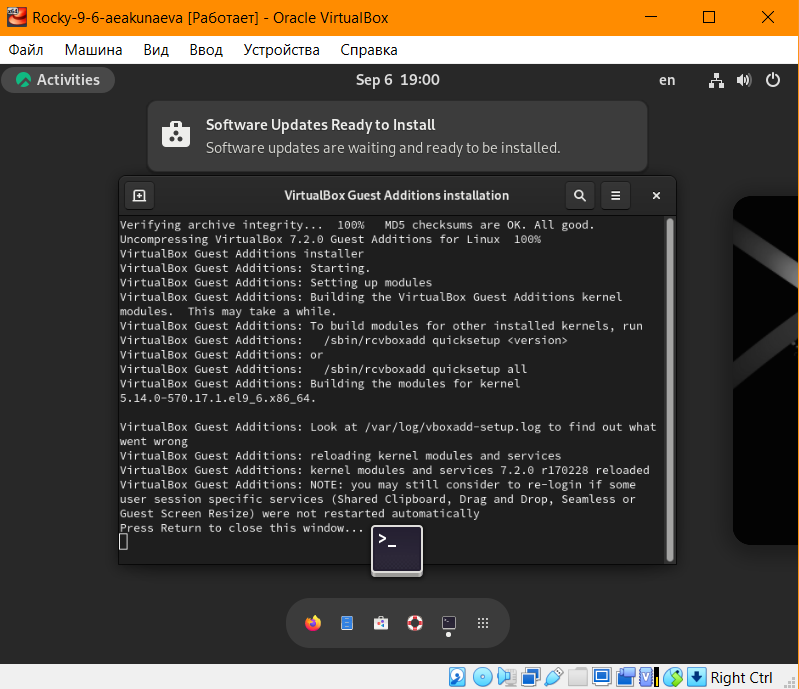{#fig-015 width=70%}


# Выполнение домашней работы

## Использование команды dmesg | less

```
dmesg | less
```

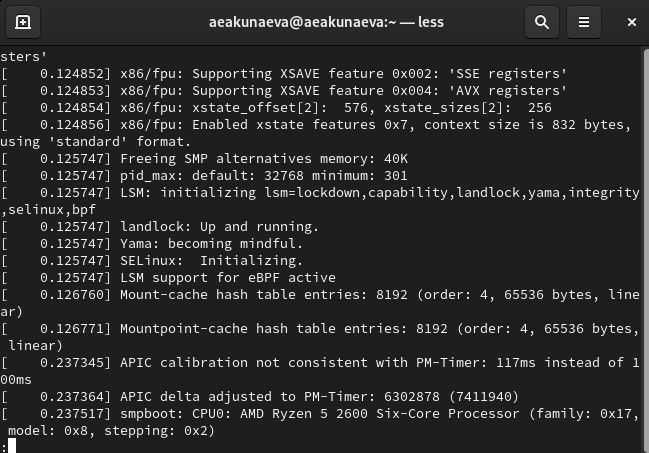{#fig-016 width=70%}

## Нахождение версии ядра Linux при помощи dmesg | grep -i

```
dmesg | grep -i "version"
```

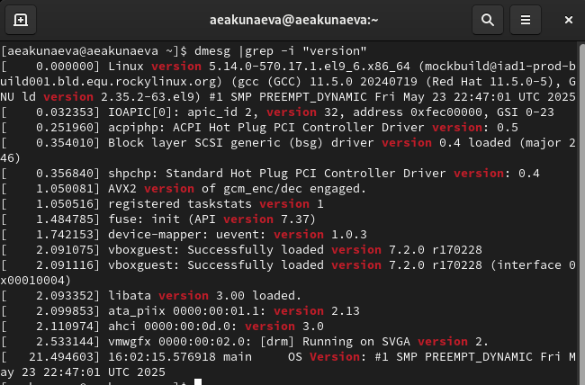{#fig-017 width=70%}

## Нахождение частоты процессора при помощи dmesg | grep -i

```
dmesg | grep -i "processor"
```

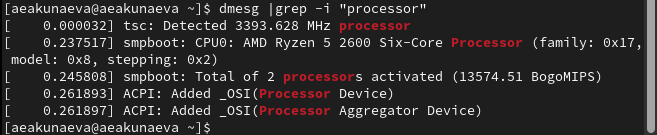{#fig-018 width=70%}

## Нахождение модели процессора при помощи dmesg | grep -i

```
dmesg | grep -i "CPU0"
```

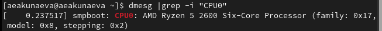{#fig-019 width=70%}

## Нахождение доступной оперативной памяти при помощи dmesg | grep -i

```
dmesg | grep -i "memory"
```

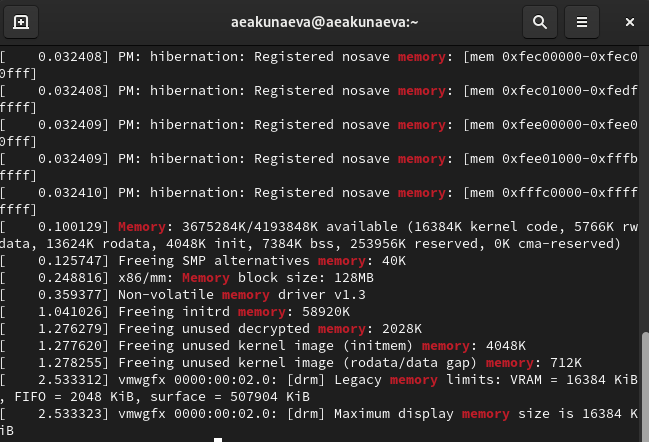{#fig-020 width=70%}

## Нахождение типа обнаруженного гипервизора при помощи dmesg | grep -i

```
dmesg | grep -i "hypervisor"
```

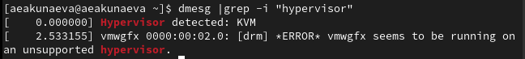{#fig-021 width=70%}

## Нахождение информации о файловых системах при помощи dmesg | grep -i

```
dmesg | grep -i "filesystem"
```

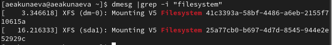{#fig-022 width=70%}


# Выводы

Я приобрела практические навыки установки операционной системы на виртуальную машину и настройки минимально необходимых для дальнейшей работы сервисов.


