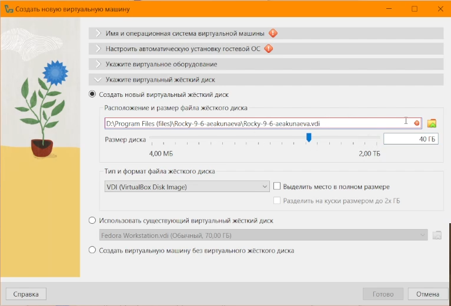
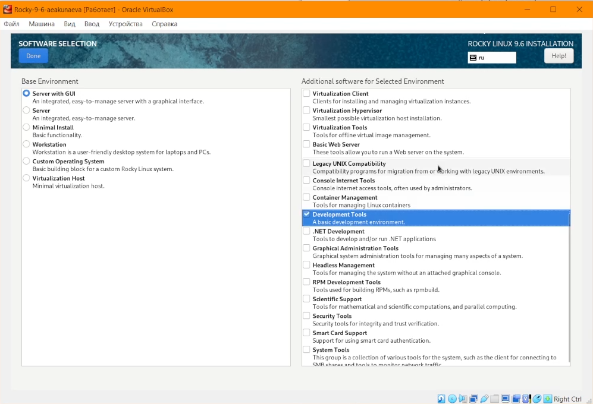
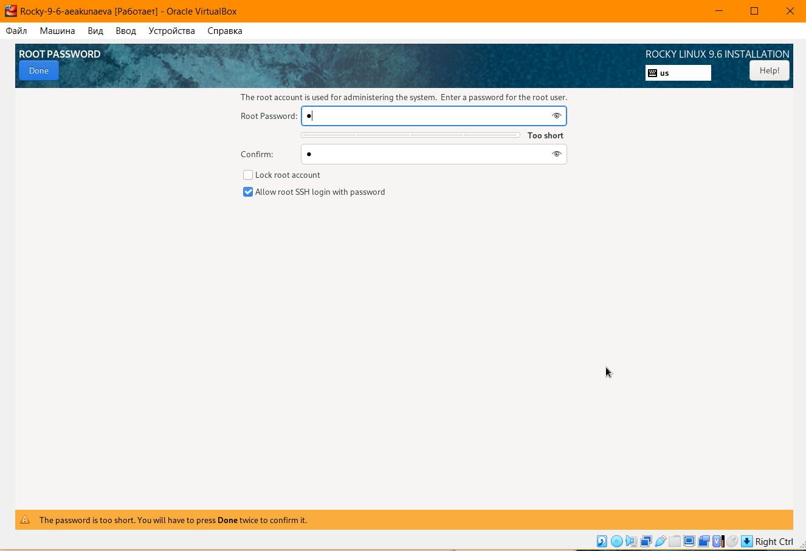
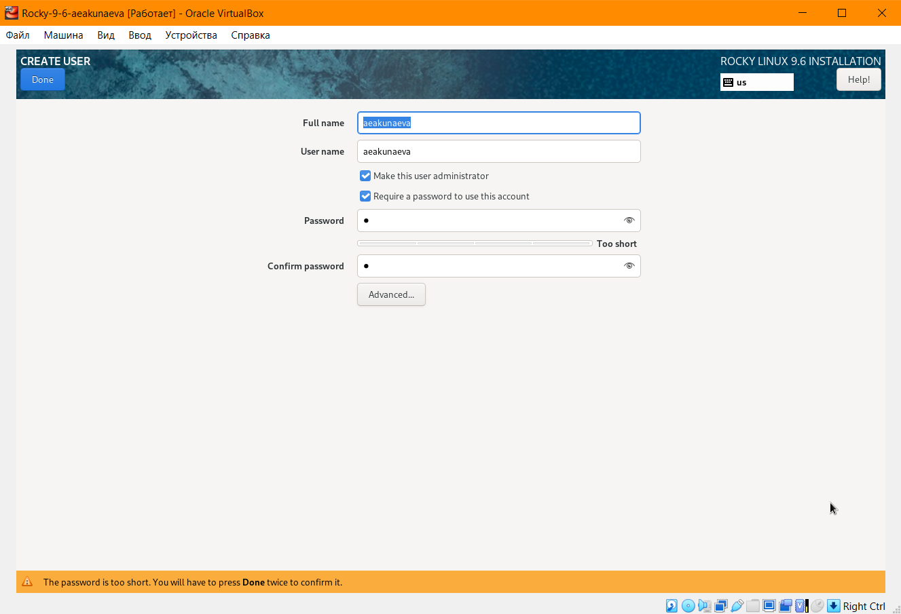

---
## Front matter
lang: ru-RU
title: Лабораторная работа №1
subtitle: Установка и конфигурация операционной системы на виртуальную машину
author:
  - Акунаева Антонина Эрдниевна
institute:
  - Российский университет дружбы народов, Москва, Россия
  
date: 2025-09-06

## i18n babel
babel-lang: russian
babel-otherlangs: english

## Formatting pdf
toc: false
toc-title: Содержание
slide_level: 2
aspectratio: 169
section-titles: true
theme: metropolis
header-includes:
 - \metroset{progressbar=frametitle,sectionpage=progressbar,numbering=fraction}
---

# Информация

## Докладчик

:::::::::::::: {.columns align=center}
::: {.column width="70%"}

  * Акунаева Антонина Эрдниевна
  * студент ФФМиЕН, НПИбд-01-24
  * Российский университет дружбы народов
  * [1032240492@pfur.ru](mailto:1032240492@pfur.ru)
  * <https://github.com/Akuxee>

:::
::: {.column width="30%"}


:::
::::::::::::::

# Цели и задачи

- Целью данной работы является приобретение практических навыков установки операционной системы на виртуальную машину, настройки минимально необходимых для дальнейшей работы сервисов.
- Выполнить домашнюю работу после выполнения лабораторной работы.

# Материалы и методы

- Linux (дистрибутив Rocky 9.6)
- Linux Fedora Workstation (Markdown)
- Oracle VirtualBox

# Выполнение лабораторной работы

## Создание ОС Rocky Linux

{#fig-001 width=70%}

## Виртуальное оборудование Rocky Linux

{#fig-002 width=70%}

## Виртуальный жёсткий диск Rocky Linux

{#fig-003 width=70%}

## Окно установки Rocky Linux

{#fig-004 width=70%}

## Окно установки Rocky Linux

{#fig-005 width=70%}

## Настройка Rocky Linux: оборудование

{#fig-006 width=70%}

## Настройка Rocky Linux: раскладка клавиатуры

{#fig-007 width=70%}

## Настройка Rocky Linux: поддержка языков

{#fig-008 width=70%}

## Настройка Rocky Linux: KDUMP

{#fig-009 width=70%}

## Настройка Rocky Linux: настройка сети

{#fig-010 width=70%}

## Настройка Rocky Linux: добавление пароля root

{#fig-011 width=70%}

## Настройка Rocky Linux: добавление администратора

{#fig-012 width=70%}

## Завершение настройки Rocky Linux

{#fig-013 width=70%}

## Завершение установки Rocky Linux

{#fig-014 width=70%}

## Подключение образа диска дополнений гостевой ОС

{#fig-015 width=70%}


# Выполнение домашней работы

## Использование команды dmesg | less

```
dmesg | less
```

{#fig-016 width=70%}

## Нахождение версии ядра Linux при помощи dmesg | grep -i

```
dmesg | grep -i "version"
```

{#fig-017 width=70%}

## Нахождение частоты процессора при помощи dmesg | grep -i

```
dmesg | grep -i "processor"
```

{#fig-018 width=70%}

## Нахождение модели процессора при помощи dmesg | grep -i

```
dmesg | grep -i "CPU0"
```

{#fig-019 width=70%}

## Нахождение доступной оперативной памяти при помощи dmesg | grep -i

```
dmesg | grep -i "memory"
```

{#fig-020 width=70%}

## Нахождение типа обнаруженного гипервизора при помощи dmesg | grep -i

```
dmesg | grep -i "hypervisor"
```

{#fig-021 width=70%}

## Нахождение информации о файловых системах при помощи dmesg | grep -i

```
dmesg | grep -i "filesystem"
```

{#fig-022 width=70%}


# Выводы

Я приобрела практические навыки установки операционной системы на виртуальную машину и настройки минимально необходимых для дальнейшей работы сервисов.


