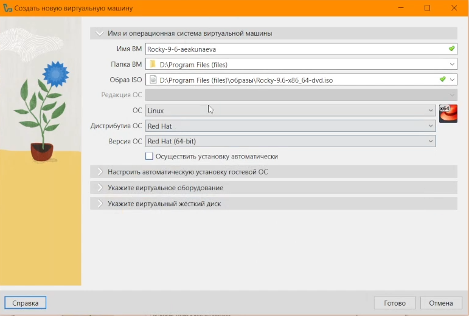
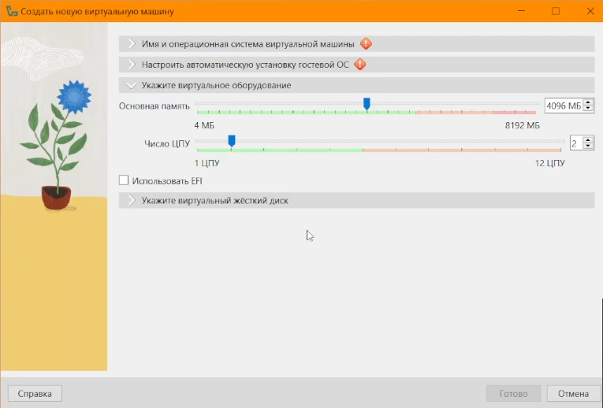
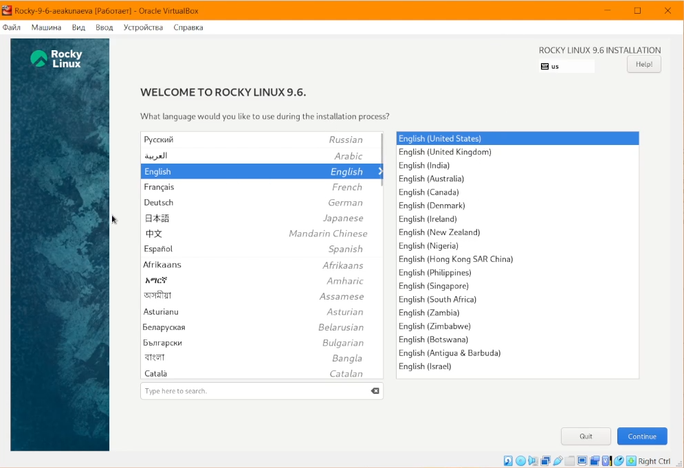
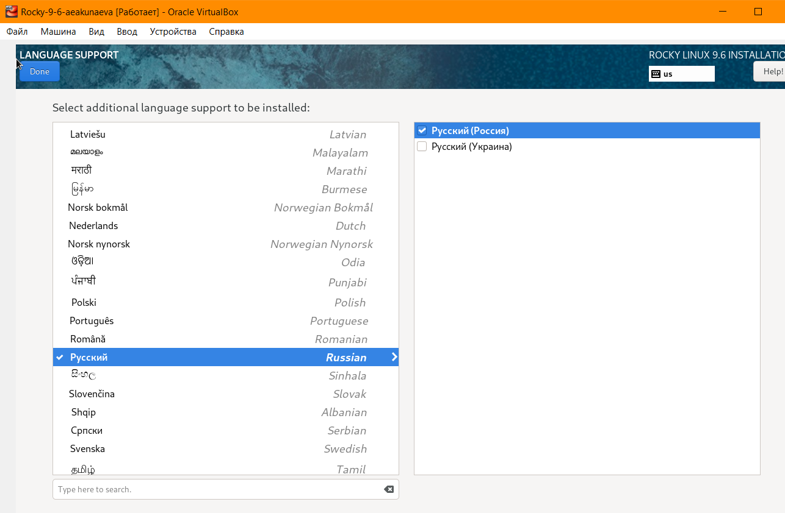
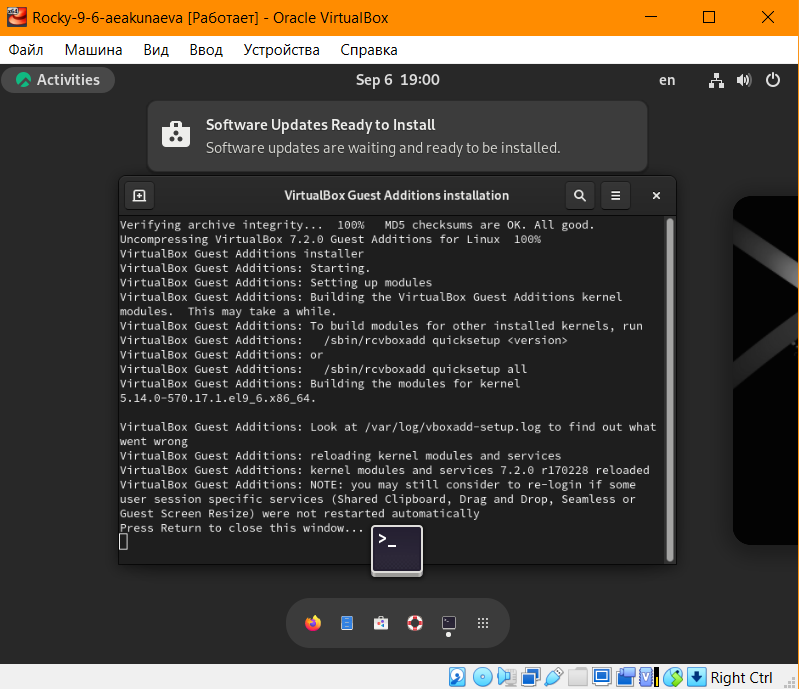

---
## Author
author:
  name: Акунаева Антонина Эрдниевна
  degrees: Bachelor, 2nd course
  orcid: 0000-0002-0877-7063
  email: 1032240492@pfur.ru
  affiliation:
    - name: Российский университет дружбы народов
      country: Российская Федерация
      postal-code: 115419
      city: Москва
      address: ул. Орджоникидзе, д. 3

## Title
title: "Отчёт по лабораторной работе №1"
subtitle: "Установка и конфигурация операционной системы на виртуальную машину"
license: "CC BY"
---

# Цель работы

Целью данной работы является приобретение практических навыков установки операционной системы на виртуальную машину, настройки минимально необходимых для дальнейшей работы сервисов. [@TUIS-lab1]

# Выполнение лабораторной работы

Запускаем Oracle VirtualBox и создаём операционную систему виртуальной машины - Rocky (дистрибутив Linux). Задаём имя и остальные параметры, указываем образ диска ОС ([рис. @fig-001]).

{#fig-001 width=70%}

Задаём значения для выделяемой основной памяти и ЦПУ как 4096 МБ и 2 ядра ([рис. @fig-002]).

{#fig-002 width=70%}

Выделяем для жёсткого диска 40 ГБ памяти ([рис. @fig-003]). Затем запускаем виртуальную машину.

{#fig-003 width=70%}

В окне запущенной ВМ выбираем *Install Rocky Linux 9.6* ([рис. @fig-004]).

{#fig-004 width=70%}

Выбираем основным языком ОС - английский (США) ([рис. @fig-005]).

{#fig-005 width=70%}

Во вкладке *Software selection* выбираем *Server with GUI*, а справа находим и отмечаем *Development Tools*, как указано в требованиях лабораторной работы ([рис. @fig-006]).

{#fig-006 width=70%}

Добавляем во вкладке раскладки клавиатуры русский язык (Россия) и настраиваем удобный шорткат для смены языков (в нашем случае *Alt+Shift*) ([рис. @fig-007]).

{#fig-007 width=70%}

Добавляем поддержку русского языка ([рис. @fig-008]).

{#fig-008 width=70%}

Отключаем KDUMP ([рис. @fig-009]).

{#fig-009 width=70%}

Во вкладке настройки сети подключаем её и изменяем имя хоста на собственное (*aeakunaeva.localmain*) ([рис. @fig-010]).

{#fig-010 width=70%}

Устанавливаем пароль для администрирования и добавляем возможность логина SSH с этим паролем ([рис. @fig-011]). Также добавляем аккаунт администратора с паролем ([рис. @fig-012]).

{#fig-011 width=70%}

{#fig-012 width=70%}

После завершения настройки устанавливаем ОС ([рис. @fig-013]-[рис. @fig-014]).

{#fig-013 width=70%}

{#fig-014 width=70%}

Войдя под своим аккаунтом администратора, выбираем у ВМ *Устройства -> Подключить образ диска дополнений гостевой ОС*, дожидаемся установки и перезапускаем виртуальную машину ([рис. @fig-015]).

{#fig-015 width=70%}

# Домашнее задание

Войдём в систему под своим аккаунтом, в терминале пропишем команду и ознакомимся с её выводом ([рис. @fig-016]):

```
dmesg | less
```

{#fig-016 width=70%}

Далее используем команду *dmesg*, чтобы определить некоторые данные:

1. Версия ядра Linux - 5.14.0-570.17.1.el9_6.x86_64 ([рис. @fig-017]):

```
dmesg | grep -i "version"
```

{#fig-017 width=70%}

2. Частота процессора - 3393.628 MHz ([рис. @fig-018]):

```
dmesg | grep -i "processor"
```

{#fig-018 width=70%}

3. Модель процессора - AMD Ryzen 5 2600 Six-Core Processor ([рис. @fig-019]):

```
dmesg | grep -i "CPU0"
```

{#fig-019 width=70%}

4. Объём доступной оперативной памяти - 3675284K/4193848K ([рис. @fig-020]):

```
dmesg | grep -i "memory"
```

{#fig-020 width=70%}

5. Тип обнаруженного гипервизора - KVM ([рис. @fig-021]):

```
dmesg | grep -i "hypervisor"
```

{#fig-021 width=70%}

6-7. Тип файловой системы корневого раздела - XFS (dm-0). Здесь же видна последовательность монтирования файловых систем ([рис. @fig-022]):

```
dmesg | grep -i "filesystem"
```

{#fig-022 width=70%}

# Выводы

Я приобрела практические навыки установки операционной системы на виртуальную машину и настройки минимально необходимых для дальнейшей работы сервисов.

# Список литературы{.unnumbered}

::: {#refs}
:::
